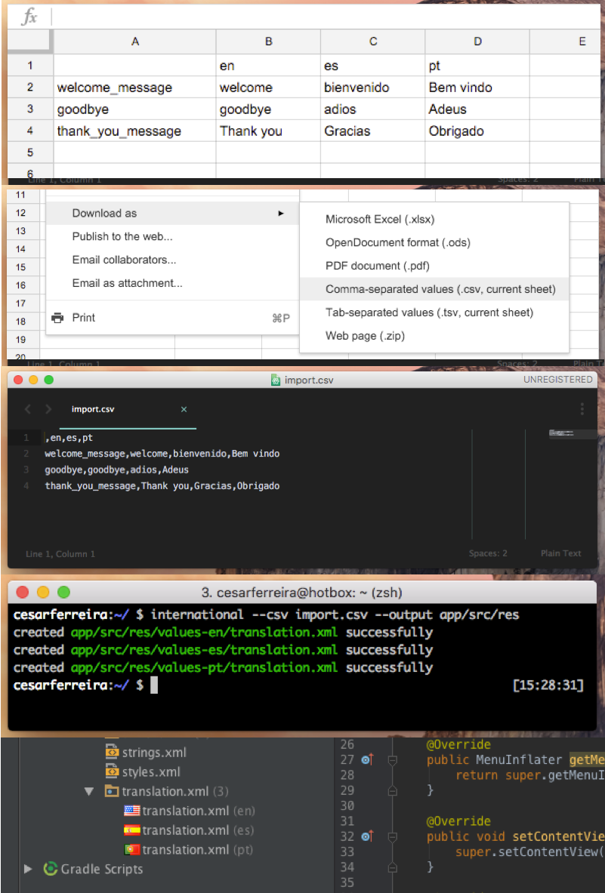

# International 


[](https://badge.fury.io/rb/international)

> Convert translations from a .csv to the localization files
> Convert CSV to localization strings, for both ANDROID and iOS

<p align="center">

</p>

## Usage

This will create the localization for you, based on a `.csv` file

```bash
  international --csv ~/import.csv
```

### Given this `~/import.csv`
```csv
,pt,en,es
welcome_message,Bem vindo,welcome,bienvenido
goodbye,adeus,goodbye,adios
```

### Will have this output:
English output for **android**, `/values-en/translation.xml`:

```xml
<?xml version="1.0" ?>
<resources>
    <string name="welcome_message">hello</string>
    <string name="thank_you_message">thank you</string>
    <string name="goodbye_message">goodbye</string>
</resources>
```

English output for **iOS**, `iosApp/en.lbproj/Localizable.strings`:

```bash
WELCOME_MESSAGE="Welcome";
THANK_YOU_MESSAGE="Thank you";
GOODBYE_MESSAGE="Goodbye";
```

### More complete:

```bash
  # For iOS
  international --csv ~/import.csv --platform ios --output iosApp/
  # For Android
  international --csv ~/import.csv --platform android --output app/src/main/res/
```


## Full usage
```bash

Usage: international [OPTIONS]

Options
  -c, --csv PATH_TO_CSV         # Path to the .csv file
  -o, --output PATH_TO_OUTPUT   # Path to the desired output folder
  -p, --platform PLATFORM       # Choose between "android" and "ios" (default: "android")
  -d, --dryrun                  # Only simulates the output and don't write files
  -h, --help                    # Displays help
  -v, --version                 # Displays version

```

## Installation

    $ gem install international

## License

The gem is available as open source under the terms of the [MIT License](http://opensource.org/licenses/MIT).
